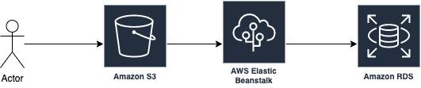

# Infrastructure description

## Frontend
The udgram app deploys assets from the front end build step to an S3 Bucket. That bucket is configured to serve those components publicly to browsers.

After the front end load it uses API connection to the backend.

## Backend
The backend is deployed from built assets to elastic beanstalk using the `eb` commands.

The backend API built on top of Node.JS uses a postgres DB for storage.

## Database

The postgres DB is hosted in RDS AWS service. Schema and tables are defined in the `udagram/udagram-api/src/sequelize.ts` file.

## Architecture daigram:

