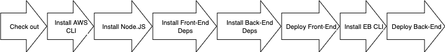

# Pipeline process
1. Checkout code
2. Install aws-cli
3. Install node@16.13
4. Verify node installation
5. Install Front-End dependencies
6. Install Back-End dependencies
7. Front-End Build
8. Back-End Build
9. Deploy Front-End to S3
10. Install aws-elastic-beanstalk CLI
11. Deploy Back-End to Elastic Beanstalk
    

